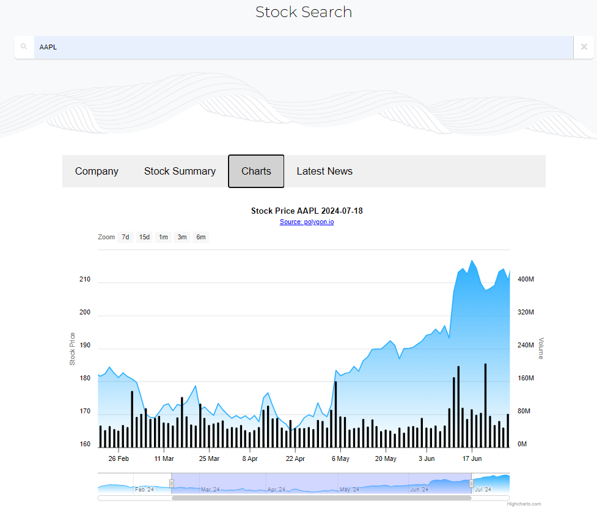

# Live Stocks Ticker

A responsive live stock ticker app with advanced search functionality that asynchronously fetches and displays comprehensive information for various stocks. Users can effortlessly search for specific stocks and receive real-time updates on stock prices, market trends, and other essential financial data to stay informed with the most up-to-date stock information.

## Deployed Application

[Live Stock Ticker](https://saunaktrojan.wl.r.appspot.com/)

## Tech Stack

**Client:** React, CSS, JS

**Server:** Flask, Node.js, MongoDB NoSQL

Hosted on GCP App Engine

## Features

- **Company Information:** Details about the company including stock exchange and IPO date

- **Stock Summary:** Various stock details such as opening and closing price along with recommendation trends

- **Charts:** Historical chart data for stocks including stock price and volume represented in the form of lines and candlesticks

- **Latest News:** Latest news of the company including links to original posts

